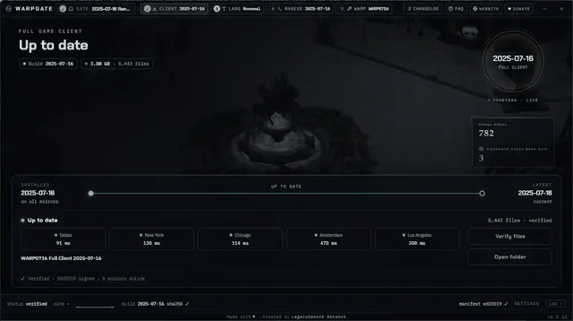

# WARP0716


**[warp.legacygamers.net](https://warp.legacygamers.net)** is the project website: a guide for every patch that needs files from you, an FAQ for a client that will not start, and one changelog covering both WARP0716 and WARPGATE.

## Development Status - Active Again

**WARP0716 development has resumed.** After a pause, the project is back open, and I'll keep working on patches as time allows.

**What's been built so far:**
- 268 patches that work on the 2025-07-16 kRO Ragexe client, 37 of them recommended by default
- Custom Jobs system (Reforged)
- Party HP/SP Bars (Reforged), with the rAthena patch that feeds it
- Custom Buttons, for adding your own buttons to the Basic Info window
- EnableCustomFonts, fully rewritten to load .ttf fonts natively
- Multi-connection clientinfo support
- A working exit button on the service select screen
- …and plenty more improvements across the board

**Running a newer client?** [WARP2026](https://github.com/zVictorHG/WARP2026-Project) by zVictorHG targets the **2026-01-07 Ragexe** ([rAthena thread](https://rathena.org/board/topic/149414-2026-01-07-ragexe-clientinfo-warp/)). Some patches, like CustomJobs, will be ported over there as time allows.

Thanks to everyone who's tested, reported issues, and helped shape WARP0716. Your bug reports and feedback are what keep this project moving.

---

WARP patches for the 2025-07-16 kRO client build. 20+ patches fixed, dead/incompatible patches removed, and all patch descriptions rewritten for the 07-16 client. If you find something off, please [open an issue](https://github.com/CrazyBebop/WARP0716/issues).

## Getting the Client

The easiest way to play is **WARPGATE**, a one-click downloader and updater.

**[Download WARPGATE](https://mirror2.romirrors.com/downloads/Warpgate.zip)**

Unzip it and run it. WARPGATE downloads the full 2025-07-16 client for you, keeps the English translation up to date (powered by [llchrisll/ROenglishRE](https://github.com/llchrisll/ROenglishRE/)), and updates itself. No manual EXE patching, no hunting down GRFs, no ClientGenerator steps. Download, run, and play.



That's all most people need. The sections below are for server operators and tinkerers who want to build or customize their own client.

## What's New

See **[CHANGELOG.md](CHANGELOG.md)** for every patch and update, newest first.

The latest is the **September 4, 2026 update**: two new patches, six fixes and a new `WARP.exe`. Party HP/SP Bars (Reforged) splits every party member's bar into an HP half and an SP half with colours you choose, and Custom Buttons lets you add your own buttons past the 25 the client ships with. The fixes cover the experience bar limits, the player bar resize, the zoom presets and the walk delay, and both the Hide and Show Buttons patches now list every button this client has. This one is a patch update, so re-apply WARP to use it.

The **July 29, 2026 Ragexe update** before it fixed the exit button on server select, switching to a different server mid-session, an 8 server limit at start-up, and a broken `clientinfo.xml` that said nothing about what was wrong. Those fixes are in the executable itself, so get the new one through **[WARPGATE](https://mirror2.romirrors.com/downloads/Warpgate.zip)** (the **RAGEXE** tab) rather than by re-WARPing an older exe.

**Guides:** [warp.legacygamers.net/warp0716](https://warp.legacygamers.net/warp0716/) (Custom Jobs, Custom Buttons, Party HP/SP Bars). The guides live on the website, not in this repository. The two hair guides, Custom Hairstyles and Hair Colours, are coming with the hair patches.

**Examples:** `examples/` holds the Custom Jobs example job (a drop-in `data/` tree: Lua, sprites, IMFs, icons) with its annotated Lua reference, and the Party HP/SP Bars server patch. Each guide on the website links the folder it needs.

## Advanced: Patch Your Own EXE with WARP

WARP is the patcher that WARPGATE's client is built with. If you run your own server or want to hand-pick your patch set, you can WARP an exe yourself. This build of WARP is tuned for the **2025-07-16 kRO Ragexe** (build 175220998).

Start from the Ragexe WARPGATE installs, `2025-07-16_Ragexe_175220998_clientinfo.exe`, rather than one you unpacked yourself. It is the same client with `clientinfo.xml` support already injected, and some patches depend on that. Get it through [WARPGATE](https://mirror2.romirrors.com/downloads/Warpgate.zip) on the **RAGEXE** tab.

You can get the WARP patcher two ways: from this repo (`win32/WARP.exe`), or by downloading it through [WARPGATE](https://mirror2.romirrors.com/downloads/Warpgate.zip).

### Setup
1. Launch `win32/WARP.exe` (or the copy from WARPGATE)
2. Load `2025-07-16_Ragexe_175220998_clientinfo.exe`
3. Select your patches and apply

### Recommended Patches
Click **"Select Recommended"** in the WARP GUI to load the recommended set, all 37 of them, in one click. That button reads `profiles/community_recommended.yml`, so the file and the button are always the same set. You can also run it straight from the console:

```
win32\WARP_console.exe -using profiles/community_recommended.yml
```

### Known Conflict
**NoPassEncr** requires **UseOldLogin**. Do not enable both **UseSSOLogin** and **NoPassEncr**. The WARP GUI handles this automatically, but YAML profiles need manual care.

## Issues & Suggestions

Found a bug or have a suggestion? Post it in the [Issues](https://github.com/CrazyBebop/WARP0716/issues) section or join the [Discord](https://discord.com/invite/7CpRVcmjeB).

## Donate

It is never required, but if you feel the need to contribute to the project financially, you can do so by clicking the button below.

<a href="https://www.buymeacoffee.com/crazybebop"></a>

Special thanks to everyone who has donated. Your support keeps this project going.

## Credits

Built on [WARP](https://github.com/Neo-Mind/WARP) by Neo-Mind and [Warp2025](https://github.com/hiphop9/Warp2025) by hiphop9.
