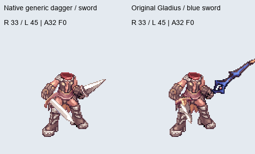
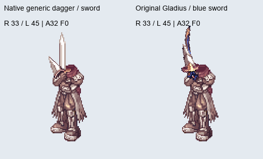
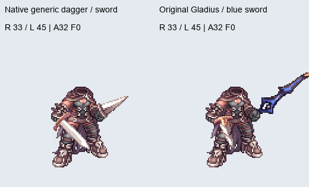
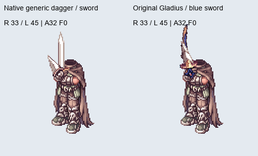

# Original dual-wield weapon sprites — 2025-07-16 Ragexe

This is the single maintained document for `AllowDualCustomWeaponSprites`. It covers the supported assets, placement rules, runtime hooks, installation and reproducible evidence. Historical experiment documents and debug captures have been retired.

The current installed build was accepted by the user on 2026-09-07. The cleanup preserves its compiled compositor **byte for byte**. Automated coverage below is broader than live visual acceptance; it does not claim that every job and weapon was inspected in game.

## Supported bodies and weapons

Target: **32-bit 2025-07-16 Ragexe 175220998**, image base 0x00400000. Both genders have independent profiles for Assassin, High Assassin, Assassin Cross, Guillotine Cross and Shadow Cross: **ten body profiles**. The first four share the Assassin weapon folder; Shadow Cross uses its own.

The audit resolves the active standard and CLS Lua tables against the registered GRFs and loose files. It finds these **24 non-Drake views** in classes **1 / 2 / 6**:

| View | Artwork |
|---|---|
| 1 / 2 / 6 | Generic dagger / sword / axe |
| 31 / 32 / 33 | Main Gauche / Stiletto / Gladius |
| 34 / 35 / 36 | Zeny Knife / Poison Knife / Princess Knife |
| 37 / 38 | Sasimi / Lacma |
| 39 / 40 / 41 | Tsurugi / Ring Pommel Saber / Haedonggum |
| 42 / 43 / 44 | Saber / Jewel Sword / Gaia Sword |
| 45 / 46 / 47 | Blue Twin Edge / Red Twin Edge / Priest Sword |
| 58 / 59 / 60 / 61 | Hammer / Buster / Brood Axe / Right Epsilon |

Every ordered combination is covered, including dagger/dagger and off-hand-only equipment. Items sharing a view share its artwork. Drake views 200–206 and 600–606 remain excluded. Other weapon classes, unmapped views, custom body replacements and the 2026 client retain stock behavior or are rejected by the patch profile.

The [resource manifest](evidence/assassin-weapon-manifest-20260907.json) covers **96 required ACT/SPR pairs**: 24 views × two weapon folders × two genders. It records no missing required pair after the compatibility assets are installed. Its additional 180 unregistered pairs are inventory findings, not claims of supported numeric views.

### Lua resource mapping

The item ID, weapon view, base class and resource suffix are distinct. For example, Gladius view 33 requests suffix `_1219`; a slotted Gladius can have a different item ID. The owner checks the native item-to-view result, resolves the class and compares both loaded ACT/SPR filenames against the actual Lua suffix. A successful resource load alone is insufficient because the native loader can return generic fallback artwork.

Adding filenames without a corresponding active view mapping does not register a new weapon. Adding a view without image/body profiles does not establish correct placement.

## Bugs corrected

- **Patch discovery:** the QJS filename, exported function and YAML entry all use `AllowDualCustomWeaponSprites`. The earlier PR mixed that export with `AllowDualWeaponSprites`, allowing WARP to write an EXE without applying the selected patch. Verification checks the emitted hooks and binary `.epi` entry, not just process exit status.
- **Original resources and stale equipment:** the owner retains each exact individual SPR/ACT pair with native AddRef/Release calls while restoring stock equipment state before publication. Shields, empty slots, unknown views, partial loads and mismatched fallback filenames do not leave a stale custom weapon.
- **Dagger/dagger and off-only placement:** native combined weapon channels are not physical hand indices. Dispatch now uses the current body, anatomical slot, animation, direction, frame and image profile instead of assuming the working sword/dagger carrier applies unchanged to every pair.
- **Male and female asset gaps:** male Gladius assets did not supply the missing female pair. The female view gate also excluded Main Gauche, Stiletto and Gladius, and originally admitted only one female body. Both the missing resources and the independent body/view restrictions are corrected.
- **Native ABI:** D8A1D0 and D60DE0 take the item ID on the stack and do not consume an incoming `ECX` receiver. The dead `MOV ECX, 0x015FA3C0` assignments are removed; that address is not an item database receiver.
- **Executable-page protection:** the writable state occupies complete dedicated pages. VirtualProtect cannot strip EXECUTE from adjacent owner or trampoline code.

## Compatibility assets and installation

Keep the patch script and these runtime files together:

- `Inputs/DualWeaponRuntime/compositor.dwcp` and `compositor.json`
- `Inputs/DualWeaponRuntime/legacy-support.dwls` and `legacy-support.json`
- `Inputs/DualWeaponRuntime/dual_weapon_male_assets.grf`

WARP consumes the first two bundles without a compiler or renderer DLL. Copy the GRF into the game directory and register it at highest priority in the loader the client actually uses. For GRFsEmbedded, select the matching archive list when repatching; `Inputs/DualWeaponRuntime/embedded-grfs-20250716.ini` is the tested list. Changing DATA.INI does not affect an EXE whose archive list is embedded. That example list requires the named base archives to exist in the client installation.

The archive's historical name is retained for loader compatibility; it now contains **60 entries for both genders**:

- Male Main Gauche, Stiletto and Gladius pairs in both weapon folders.
- Female Main Gauche, Stiletto and Gladius: original female Thief SPR bytes and adapted Assassin ACT timelines.
- Missing male/female Shadow Cross Priest Sword names: aliases of the corresponding original Assassin pair.
- Four expanded axes for both genders and folders: original Swordsman SPR bytes with adapted Assassin ACT timelines and independent image-axis mappings.

Donor SPR bytes are unchanged. Adapted ACTs are authored compatibility data, not stock Assassin animations. Full weapons and detached attack fragments have separate image mappings. The [asset report](evidence/assassin-weapon-assets-20260907.json) records donors, hashes and cells. The earlier female-dagger report is retained only as generator provenance; the **60-entry** archive is the final package.

Apply the patch to a source with stock dual-weapon hook bytes. The script rejects occupied hooks; applying it over an older dual-wield patch is not a supported upgrade path. Preserve other selected patches through the normal WARP session. The checked-in existing-client builder accepts a verified stock-hook copy and preserves other mapped sections.

## Coordinates, frames, directions and angles

The accepted female Assassin Cross 17-view geometry and existing male 20-view geometry remain unchanged. Added bodies and images have separate contacts and fingerprints; female Shadow Cross's generic sword also requires its own image key.

ACT file x/y are image centers. Loaded layer x/y subtract the image half-size, and native C40C20 projection adds a one-unit rectangle endpoint. Contact projection accounts for those conventions before aligning hand and hilt texel edges. A global x/y nudge cannot correct weapons with different hilt locations, blade axes, mirrors or source frames.

| Animation | Placement contract |
|---|---|
| Held actions 32–39, frames 0–5 | Body-specific fist contacts, image-specific hilt endpoints and native direction/mirror/angle |
| Dual attack actions 88–95, frames 0–7 | Accepted generic trajectory, mapped to the corresponding individual source cell, including solo actions 80–87 where needed |
| Other off-only phases | Native original ACT transfer; no standing-palm correction applied to detached attack fragments |

The main/right equipment slot follows the anatomical right arm. Its screen side changes with body direction and mirroring. Channel 5 is the combined weapon packet; channel 6 is its overlay/slash channel. Neither is a hand number. Existing male slash behavior and female channel ownership are preserved.

These finite contact tables do not replace every animation in the 104-action ACT format.

## Animation references

These are the earlier **CPU/native-projection previews**, using original ACT/SPR assets. They compare generic guides with original Gladius/blue Twin Edge rendering. They are not live-client recordings; heads, effects and GPU body-depth occlusion are omitted.

| Female Assassin Cross | Male Assassin Cross |
|---|---|
|  |  |

| Female Shadow Cross | Male Shadow Cross |
|---|---|
|  |  |

## Runtime layout and cleanup

The readable QJS is **38,397 bytes**, reduced from 292,780 before bundle extraction; its longest line is **119 characters**. It performs validation, allocation, equipment ownership and hook emission. The active compositor is readable C with generated image/body headers under `CustomDLL/DualWeapon`.

The cleanup removes the metadata-capture hook/ring, calibration state, debug strings/imports/thunks, stale parameters and the unused legacy compositor injection. The frozen depth helper remains active. Its bytes and all retained wrapper emissions are unchanged. Reserved fields in the 21-DWORD context remain zero to preserve the compiled ABI.

The support bundle retains a frozen legacy core and rig as offline reference inputs; they are no longer allocated into the client. DWLS v1 validates magic/version, dimensions, CRC, reserved fields and relocation bounds/duplicates before EXE access. It has a 48-byte header followed by component images and relocation pairs; relocation replaces the target word. DWCP similarly validates its payload before writing hooks.

Historical builders, temporary deployment scripts and oversized experiment reports are removed. Shared parsing, projection, geometry and native fixtures are reusable modules. Four current geometry datasets are stored as deterministic gzip JSON under `Inputs/DualWeaponAuthored/profiles` (874,556 bytes total). The immutable `reference/accepted-20260907.dwcp` is the motion regression oracle.

### Hook addresses

These are native **2025-07-16** sites. Injected cave addresses vary with patch order and are never portable constants.

| Active hook | Original bytes | Cleanup verification candidate target |
|---|---|---|
| Equipment owner, 0x00D403A0 | 55 8B EC 6A FF | 0x021BEEC0 |
| Final draw, 0x00C4A0D0 | 55 8B EC 83 EC 50 | 0x021C7D20 |
| Vertex depth, 0x00C4A647 | A1 F8 15 25 01 | 0x021C7D00 |

The former metadata hook at **0x00605D41** remains stock in new builds. The native ACT-frame call at **0x00D36EE4** is also unchanged. The [WARP build report](evidence/dual-weapon-warp-build-20260907.json) records exact emitted bytes, targets, context, state pages and section preservation for the cleanup candidate.

## Verified results and limits

| Check | Result |
|---|---|
| Full ten-body execution matrix | 668,160 cases; 1,182,240 original-resource draws |
| Pair coverage | 576 ordered pairs per body, all eight held/attack directions and supported frames |
| Additional equipment coverage | Every view off-only; all nine ordered class carriers |
| Existing geometry | 77,952 cases; maximum change **0.0** |
| Added geometry | 75,792 draws; units 1 and 2.3423, actor angles 0/+15/−90 |
| Maximum contact/trajectory error | 0.000210084 |
| Maximum local penetration error | 0.000154294, below the 0.001 arithmetic tolerance |
| Equipment owner | 602 class/resource/slot/ABI cases |
| Allocation | 4,096 address residues; final PE protection passes |
| Packaged assets | 96 required pairs; 60 entries; 3,332 visible ACT cells; 596 distinct native projections |
| Cleanup equivalence | Compositor byte-identical; 12 wrapper relocation comparisons identical |
| Patch discovery | Matching filename/export/tree, actual WARP console application and nonempty patch-specific EPI record |

Evidence: [matrix](evidence/assassin-weapon-matrix-all-20260907.json), [geometry](evidence/assassin-weapon-geometry-20260907.json), [owner](evidence/assassin-weapon-owner-20260907.json), [cleanup source](evidence/dual-weapon-cleanup-source-20260907.json), [cleanup PE/assets](evidence/dual-weapon-cleanup-pe-assets-20260907.json), [bundle checks](evidence/dual-weapon-qjs-bundle-20260907.json), [actual WARP discovery in both trees](evidence/dual-weapon-warp-discovery-20260907.json).

These tests execute compiled x86 with real ACT/SPR data and native projection. Resource acquisition tests use explicit ABI fixtures. They verify resource identity, register/stack behavior and packet geometry; live actor dispatch and GPU occlusion require in-game checks. User acceptance applies to the installed working build, not an exhaustive visual review of every matrix cell.

### Binary identities

| Artifact | SHA-256 |
|---|---|
| Accepted installed EXE, preserved during cleanup | 6e470532594152e65a8bb2f982c6d14bb630f3a11355e6cc634e8db4f1b5c972 |
| Cleanup WARP verification EXE, not installed | 1a0c3220bd0663e953b83d049eee2abdb885026e9837fbadd8baf66c1d5af182 |
| Active DWCP, unchanged by cleanup | b8bf5902c798e4ba7a144d60f04f2b7dff3933414230e8cafc86cacb3bf33404 |
| Final compatibility GRF | 37a7e2aa876ab9b4383f86e00c0015a65555cebf919612ec2a4b57409c8930cc |

The older installed EXE retains older capture/debug scaffolding from its previous patch layout. New WARP builds omit it. No game EXE or server rebuild was performed as part of this cleanup. The separate character-list footer/gender correction is not part of this patch or PR.

## Reproduction and maintenance

Set `RO_DUAL_CLIENT` to the client directory when it differs from the tool default. The profiled executable filename is `2025-07-16_Ragexe_175220998_clientinfo_patched.exe`. Offline tools need the original GRFs plus Python with Pillow, numpy, pefile, capstone and Unicorn. C regeneration needs MSVC x86; use the builder's `--tool-dir` override for another installation.

Source/package checks:

```text
node tools/verify_dual_weapon_profile.cjs
node tools/verify_dual_weapon_legacy_bundle.cjs
node tools/verify_dual_weapon_cleanup.cjs
python tools/verify_dual_weapon_owner.py
python tools/verify_assassin_weapon_matrix.py
python tools/verify_assassin_weapon_geometry.py
python tools/render_assassin_weapon_coverage.py --exe <candidate.exe> --output <gallery-directory>
python tools/render_assassin_weapon_coverage.py --exe <candidate.exe> --output <gallery-directory>
python tools/verify_assassin_weapon_final_pe.py --exe <candidate.exe> --report <report.json>
```

The final-PE asset check also verifies the installed embedded archive-loader profile. For an EXE using another archive configuration, run `verify_dual_weapon_page_protection.py --fixed <candidate.exe>` separately and audit that configuration's actual resources.

To regenerate changed assets/profiles, run the female asset builder followed by the axe asset builder, then the female dagger/family and male axe profile builders. Their intermediate archive is not the deployable package. Run `build_dual_weapon_compositor.py`, repeat the matrix/geometry/resource checks, and promote the verified DWCP, manifest and final GRF together. Changing inherited male contacts additionally requires the male profile builder and renewed geometry acceptance.

`build_existing_dual_weapon_client.py --source <stock-hook-source.exe> --output <candidate.exe> --evidence <report.json>` runs the actual WARP console and verifies all mapped bytes outside the three hooks. It also checks/repairs WARP's section-header growth offsets on an already expanded source. This is not permission to overwrite occupied hooks or reuse an old cave address.

Runtime manifests pin exact source bytes; `.gitattributes` preserves their checkout line endings. QJS stays CRLF, UTF-8 without BOM and tab-indented. Keep current evidence and immutable expected geometry; do not restore historical debug outputs into the runtime.
