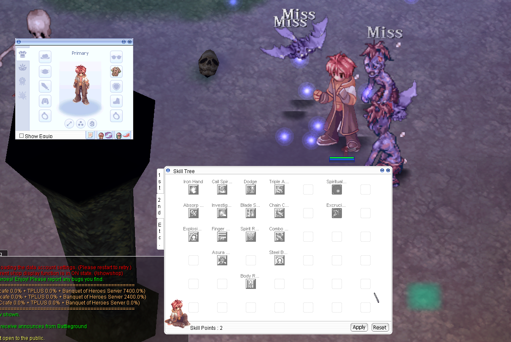

# Native ACT UI payload maintenance

`Scripts/Patches/NativeActJobPreviews.qjs` is self-contained at WARP apply time.
The files here make its embedded x86 implementation reviewable and reproducible;
no compiler, Python, generated preview assets or runtime DLL is needed to apply it.

The profile targets the 2025-07-16 x86 Ragexe layout. It validates the native
surface/texture ABI and all three hook locations before allocation. The runtime
writes ACT-transformed pixels into the native persistent CSurface, preserving
normal window movement and composition. Other callers of the shared Equipment
draw entry delegate to the original renderer. It does not modify world drawing,
resource names, job identity, GRF ordering, or installed SPR/ACT files.

The source retains native palette resolution and texture lock/unlock ownership.
It supports positive finite scale on each axis, mirror, rotation, layer tint,
native A1R5G5B5/A4R4G4B4 textures, atlas bounds and destination clipping. Window
surfaces are bounded to 8192 pixels per axis. Unknown surface/texture formats
are skipped. The native Equipment job-specific scale and anchor path remains
active; the Skill Tree retains its action/frame and head-offset selection.

## Regenerate and verify

Use Python 3.10+ and an x86 MSVC developer prompt, with `cl.exe` and `link.exe`
on PATH. Alternatively pass `--compiler` with the full x86 cl.exe path.
The checked-in payload was built with MSVC 14.51.36231. Other compiler versions
may produce different bytes and must be regenerated and verified.

```powershell
python -m pip install -r tools/requirements-native-act-job-ui.txt
python tools/build_native_act_job_ui.py
python tools/build_native_act_job_ui.py --check
python tools/verify_native_act_job_ui.py --profile-client path/to/original-client.exe
python tools/verify_native_act_job_ui_warp.py --profile-client path/to/original-client.exe
```

`build_native_act_job_ui.py --profile-client ...` optionally verifies the original
client against the recorded byte profile. A client is not required just to
regenerate QJS. The original client and generated test EXEs remain outside Git.
The profile records the reference hash for provenance but accepts matching
native bytes rather than requiring unrelated parts of the EXE to be identical.

The builder strips unused export/debug directories, validates relocations, and
writes CRLF/UTF-8-without-BOM QJS. The installer relocates the payload in memory
before a single write; overlapping payload/relocation writes can be lost when
WARP reconstructs one of its own previous outputs.

Native tests execute the emitted x86 code against synthetic texture/surface
buffers and compare unit-scale output with the original native blitter. They
cover the mid-function and thiscall ABIs, palette selection, scaling, mirroring,
rotation, clipping, atlas bounds and movement without repainting. WARP tests
exercise the actual upstream console executable, both orders with
ReduceExpensiveUIRender, reapplication, and rejection before hook writes.

A male Monk using a 2x SPR with ACT scale 0.5 has live user confirmation for the
world, standing Equipment preview and seated Skill Tree preview. Broader job,
sex, direction, animation, special-job-scale and reopen/drag combinations still
need live acceptance. Automated surface tests do not replace that acceptance.
The user-supplied preview below shows that confirmed case. Game-specific test
packs are not required by the patch and are not included.


